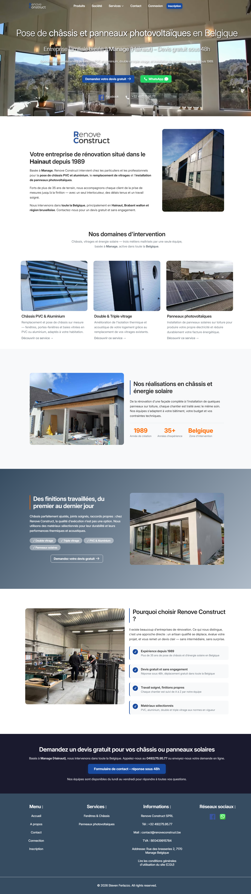
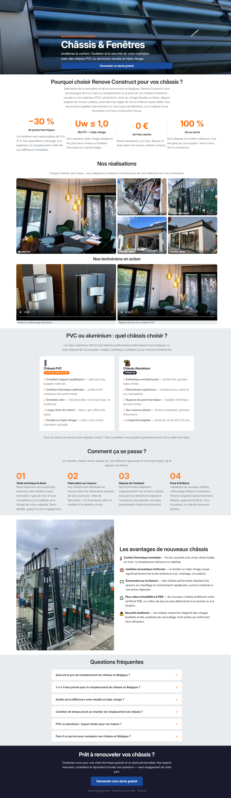
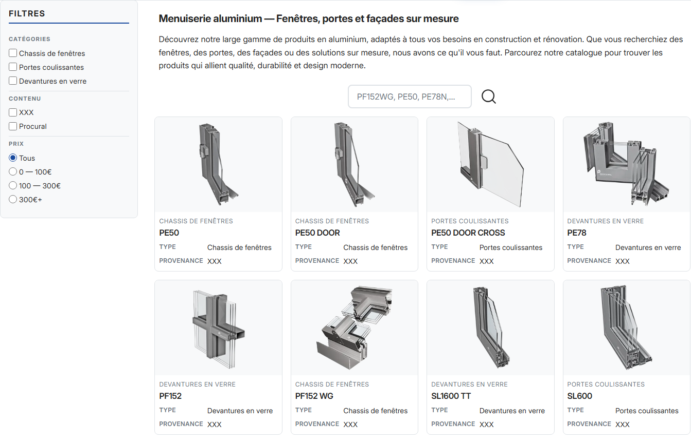
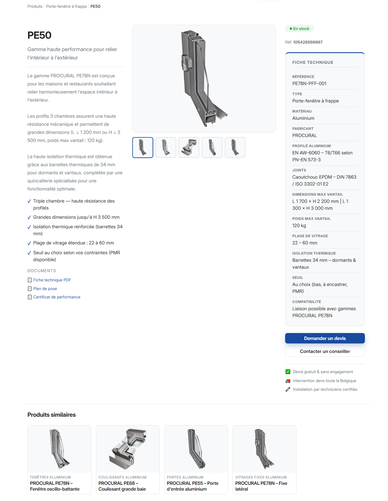
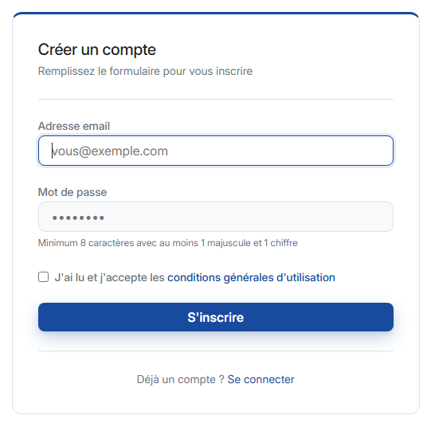

# 🏗️ RenoveConstruct.be (Renoveco)

[](https://www.php.net/)
[](https://blog.cleancoder.com/uncle-bob/2012/08/13/the-clean-architecture.html)
[](https://frankenphp.dev/)

> **Conception et mise en production d'une application métier complète développée "From Scratch" en PHP 8.1.**

Ce projet a été réalisé en autonomie totale pour démontrer ma capacité à concevoir des systèmes complexes, sécurisés et performants sans dépendre d'un framework tiers.

---

## 🎯 Objectifs du Projet

L'objectif principal était de monter en compétences sur les architectures modernes de haut niveau. Plutôt que d'utiliser des outils pré-construits, j'ai choisi de **réimplémenter les composants critiques d'un framework** pour en comprendre la logique interne et garantir une maîtrise totale de la dette technique.

## 🏗️ Architecture Technique

Le projet suit les principes de la **Clean Architecture** et du **MVC modulaire** :

*   **Core / Kernel :** Développement d'un noyau d'application (`AppKernel.php`) gérant le cycle de vie des requêtes et un conteneur d'injection de dépendances (`Container.php`).
*   **Routing par Attributs :** Système de routage moderne utilisant les attributs PHP 8.1 pour mapper les contrôleurs.
*   **Couches métier :** Architecture découpée en `Domain`, `Application` (UseCases), `Infrastructure` (Repositories) et `UI`.
*   **Moteur de templates :** Intégration de Twig pour une séparation stricte entre logique et UI.

## 🛡️ Sécurité & Performance

Le projet est conçu pour des standards de production élevés :
*   **Sécurité :** Protection CSRF (`CsrfGuard`), Rate Limiting, hashage Bcrypt et validation stricte des entrées.
*   **SEO Technique :** Génération dynamique de `sitemap.xml`, implémentation de micro-données JSON-LD (Schema.org) et gestion propre des redirections 301/404.
*   **Infrastructure :** Environnement conteneurisé avec **Docker** et serveur d'application **FrankenPHP**.

## 🛠️ Stack Technique

*   **Backend :** PHP 8.1 (POO avancée, PSR-4).
*   **Database :** MySQL (Architecture SGBD propre).
*   **Frontend :** SCSS, JavaScript (Vite), Twig.
*   **DevOps :** Docker, déploiement sur serveur Linux, sauvegardes automatisées.

## 🗂️ Architecture

```
src/
├── Modules/                        # Modules métier (1 domaine = 1 module)
│   ├── Product/
│   │   ├── Application/
│   │   │   ├── UseCase/            # Cas d'usage (ShowProductForDetail, ...)
|   |   |   ├── Service/            # Services liés à l'application
│   │   │   └── ViewModel/
│   │   ├── Domain/
│   │   │   ├── Entity/             # Entités métier (Product, ProductImage, ...)
│   │   │   └── Repository/         # Interfaces de persistence
│   │   ├── Infrastructure/
│   │   │   └── Persistence/Mysql/  # Implémentations MySQL des repositories
│   │   ├── Interface/
│   │   │   └── Http/
│   │   │       ├── Controllers/
│   │   │       └── Validator/
│   │   └── UI/Views/               # Templates Twig
│   ├── Auth/
│   ├── Category/
│   ├── Contact/
│   ├── Admin/
│   ├── User/
│   └── Shared/                     # Composants transverses (CSRF, Session, Mail, ...)
│
└── Services/
    └── Schema/                     # Builders JSON-LD (SEO structuré)

core/                               # Framework maison
├── AppKernel.php                   # Point d'entrée HTTP
├── Container.php                   # IoC / injection de dépendances
├── Routing/                        # Routeur avec attributs PHP 8 (#[Route])
├── Database/
│   ├── QueryBuilder.php            # Query builder fluent sur PDO
│   └── BaseModel.php               # Hydratation typée des entités
├── Middleware/                     # Pipeline (Auth, RBAC, Logger, Security, ...)
└── View.php                        # Moteur Twig

config/
├── services.php                    # Bindings manuels du container
├── middlewares.php                 # Déclaration du pipeline
├── access_whitelist.php            # Matrice RBAC (guest → user → admin → superadmin)
└── EnvLoader.php                   # Déchiffrement AES-256 des .env chiffrés
```
---


## 👨‍💻 Utilisation

**Prérequis :**
- VSCode
- WSL
- Docker Desktop

**Installation :**
1. Cloner le dépôt dans un répertoire local
2. *(Bientôt disponible : une base de données de démo et un `.env.local` d'exemple sont en cours de préparation)*
3. Ouvrir le répertoire dans VSCode
4. Lancer Docker Desktop
5. Construire et démarrer les containers *(FrankenPHP · MySQL · PHPMyAdmin · Node · volume DB persistant)*: 
```bash
docker-compose up --build -d
```

**Développement front-end :**
```bash
docker compose exec node npm run watch
```

**Build front-end (production) :**
```bash
docker compose exec node npm run build
```
**Accès après démarrage :**
- Application : `https://localhost`
- PHPMyAdmin : `https://localhost:8081`

## 📸 Aperçu
**Page d'acceuil:**



**Page service:**



**Page produits:**



**Page produit (détails):**



**Formulaire d'inscription:**




## 👨‍💻 À propos de moi

Titulaire d'un **Bachelier en informatique de gestion**, je combine une expérience de plus de deux ans dans le support d'environnements critiques avec une passion pour le développement logiciel moderne.

*   **Portfolio :** [renoveconstruct.be](https://renoveconstruct.be)
*   **Contact :** s.ferlazzo@protonmail.com | 0488/71.60.96
```
